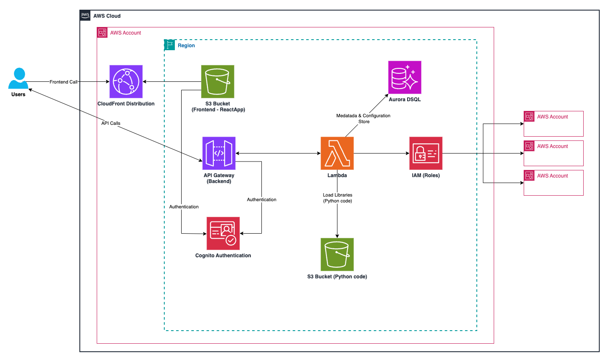

# Metadata Management Solution for AWS Services

> **Disclaimer:** The sample code; software libraries; command line tools; proofs of concept; templates; or other related technology (including any of the foregoing that are provided by our personnel) is provided to you as AWS Content under the AWS Customer Agreement, or the relevant written agreement between you and AWS (whichever applies). You are responsible for testing, securing, and optimizing the AWS Content, such as sample code, as appropriate for production grade use based on your specific quality control practices and standards. Deploying AWS Content may incur AWS charges for creating or using AWS chargeable resources, such as running Amazon EC2 instances, using Amazon CloudWatch or Amazon Cognito.


## What is Metadata Management Solution ?

Metadata Management Solution a revolutionary serverless application designed to streamline and enhance your AWS metadata management.

This powerful tool automates the tagging process across multiple accounts and regions, providing unprecedented control and visibility over your cloud infrastructure. With its advanced filtering capabilities and comprehensive metadata management,

Metadata Management Solution empowers organizations to optimize their AWS resources, improve cost allocation, and enhance security compliance effortlessly.


## Architecture




## Key features

- Cross-account and cross-region automated tagging.

- Custom tag filtering for precise resource management.

- Comprehensive metadata search functionality.

- Fully serverless architecture for scalability and cost-efficiency.


## Use cases

### Cost Allocation
A large enterprise uses Metadata Management Solution to automatically tag resources across multiple departments, enabling accurate cost attribution and budgeting.

### Security Compliance
A financial services company leverages the application to ensure all resources are properly tagged for regulatory compliance, using custom filters to identify and rectify any non-compliant resources.

### Resource Optimization
A startup uses the metadata search feature to quickly locate underutilized resources across their AWS infrastructure, allowing them to optimize their cloud spend and improve efficiency.


 

## Solution Deployment

> **Time to deploy:** Approximately 10 minutes.


 - 1.- Open Linux/MAC OS Terminal


- 2.- Setup your AWS Credentials using OS Variables in case you don't have them
```
export AWS_ACCESS_KEY_ID=XXXXXXX
export AWS_SECRET_ACCESS_KEY=XXXXXX
export AWS_DEFAULT_REGION=us-east-1
```

- 3.- Verify AWS CLI is 2.22.12 or above, if not update AWS CLI.
```
aws --version

AWS CLI Update Reference

https://docs.aws.amazon.com/cli/latest/userguide/getting-started-install.html#getting-started-install-instructions
```

- 4.- Verify NodeJS version 23.4 or above installed, if not install it.

```
#Verify
node -e "console.log('Running Node.js ' + process.version)"

#Install
curl https://raw.githubusercontent.com/nvm-sh/nvm/v0.39.5/install.sh --output install.sh
sh install.sh
. ~/.nvm/nvm.sh
nvm install 23.4.0
```

- 5.- Clone the Github repository

```
git clone https://github.com/snunezcode/mytagger.git
cd mytagger
```

- 6.- Set username for application access

```
export username=myemail@example.com
```

- 7.- Perform setup installation
```
sh setup.sh $username
```

- 8.- Open Application URL using the output PublicAppURL
```
PublicAppURL   : https://XXXXXXXX.cloudfront.net
```


## Security

See [CONTRIBUTING](CONTRIBUTING.md#security-issue-notifications) for more information.


## License

This library is licensed under the MIT-0 License. See the [LICENSE](LICENSE.txt) file.

