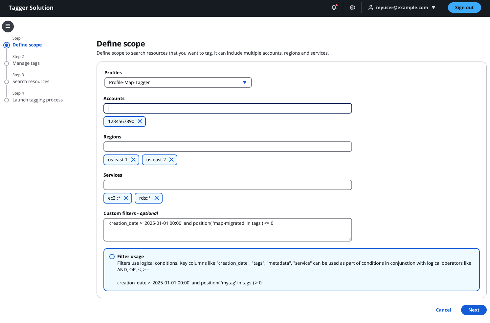

# Tagger Solution for AWS Services

> **Disclaimer:** The sample code; software libraries; command line tools; proofs of concept; templates; or other related technology (including any of the foregoing that are provided by our personnel) is provided to you as AWS Content under the AWS Customer Agreement, or the relevant written agreement between you and AWS (whichever applies). You are responsible for testing, securing, and optimizing the AWS Content, such as sample code, as appropriate for production grade use based on your specific quality control practices and standards. Deploying AWS Content may incur AWS charges for creating or using AWS chargeable resources, such as running Amazon App Runner, using Cognito, API Gateway, Aurora DSQL, Lambda, S3.

## What is Tagger Solution ?

Tagger Solution a revolutionary serverless application designed to streamline and enhance your AWS metadata management.

This powerful tool automates the tagging process across multiple accounts and regions, providing unprecedented control and visibility over your cloud infrastructure. With its advanced filtering capabilities and comprehensive metadata management,

Tagger Solution empowers organizations to optimize their AWS resources, improve cost allocation, and enhance security compliance effortlessly.

## Architecture

### Public

### Private

## How looks like ?

## Key features

- Cross-account and cross-region automated tagging.

- Custom tag filtering for precise resource management.

- Comprehensive metadata search functionality.

- Fully serverless architecture for scalability and cost-efficiency.

## Use cases

- ### Cost Allocation
A large enterprise uses Tagger Solution to automatically tag resources across multiple departments, enabling accurate cost attribution and budgeting.

- ### Security Compliance
A financial services company leverages the application to ensure all resources are properly tagged for regulatory compliance, using custom filters to identify and rectify any non-compliant resources.

- ### Resource Optimization
A startup uses the metadata search feature to quickly locate underutilized resources across their AWS infrastructure, allowing them to optimize their cloud spend and improve efficiency.

 

## Solution Deployment

> **Time to deploy:** Approximately 10 minutes.

### Public method access version

Follow these step-by-step instructions to configure and deploy the Tagger Solution into your AWS account.

1.	Sign in to the AWS Management Console
2.	Navigate to the AWS CloudFormation service
    -	From the AWS Console, search for "CloudFormation" in the search bar
    -	Click on the CloudFormation service
3.	Start Stack Creation
    -	Click the "Create stack" button
    -	Select "With new resources (standard)"
4.	Specify Template Source
    -	Choose "Upload a template file" 
    -	Click "Choose file" and select your CloudFormation template (cloudformation.public.yaml)    
    -	Click "Next"
5.	Specify Stack Details
    -	Enter a meaningful name for the stack in the "Stack name" field (e.g., "tagger-solution-frontend")
6.	Configure General Configuration Parameters
    -	GitHubRepositoryUrl: Enter the HTTPS URL for your GitHub repository (e.g., https://github.com/aws-samples/sample-tagger.git)
    -	AppUser: Enter the email address that will be used for the application user (e.g., admin@example.com )
7.	Configure Network and Security Parameters
    -	WAFRequired: Select "true" if you want to enable AWS WAF protection, or "false" to disable it
    -	IPv4CIDR: (Optional, required only if WAF is enabled) Enter the IPv4 CIDR range that should be allowed access (e.g., 192.168.1.0/24 or 0.0.0.0/0 for all IPv4 addresses)
    -	IPv6CIDR: (Optional, required only if WAF is enabled) Enter the IPv6 CIDR range that should be allowed access (e.g., 2001:db8::/32 or leave empty if not needed)
8.	Configure Stack Options (Optional)
    -	Add any tags to help identify and manage your stack resources
    -	Configure any advanced options like stack policy, rollback configuration, etc.
    -	Click "Next"
9.	Review Stack Configuration
    -	Review all the parameters and settings for your stack
    -	Scroll down and check the acknowledgment box that states "I acknowledge that AWS CloudFormation might create IAM resources with custom names"
    -	Click "Create stack"
10.	Monitor Stack Creation
    -	The CloudFormation console will display the stack creation status
    -	You can view the "Events" tab to monitor the progress and troubleshoot any issues
    -	Wait until the stack status changes to "CREATE_COMPLETE"
11.	Access Stack Outputs
    -	Once the stack creation is complete, navigate to the "Outputs" tab
    -	Here you'll find important information such as the URL to access the frontend application
12.	Verify Deployment
    -	Navigate to the provided URL to ensure the frontend is working correctly
    -	Log in using the provided application user email and credentials (you may receive temporary credentials via email)

### Private method access version

1.	Sign in to the AWS Management Console
    -	Navigate to the AWS Console at https://console.aws.amazon.com/ 
    -	Sign in with your AWS account credentials
2.	Navigate to the AWS CloudFormation service
    -	From the AWS Console, search for "CloudFormation" in the search bar at the top
    -	Click on the CloudFormation service from the dropdown results
3.	Start Stack Creation
    -	Click the "Create stack" button
    -	Select "With new resources (standard)" from the dropdown options
4.	Specify Template Source
    -	Choose "Upload a template file" 
    -	Click "Choose file" and select your CloudFormation template (cloudformation.private.yaml)    
    -	Click "Next"
5.	Specify Stack Details
    -	Enter a meaningful name for the stack in the "Stack name" field (e.g., "tagger-solution-frontend")
6.	Configure General Configuration Parameters
    -	GitHubRepositoryUrl: Enter the HTTPS URL for your GitHub repository (e.g., https://github.com/aws-samples/sample-tagger.git)
    -	AppUser: Enter the email address that will be used for the application user (e.g., admin@example.com )
7.	Configure Network and Security Parameters
    -	VPCId: Select the VPC ID from where the App Runner service will be accessed
    -	SubnetId: Select the Subnet ID from where the App Runner service will be accessed
    -	IPv4CIDR: Enter the IPv4 CIDR range that should be allowed access the App Runner service (e.g., 192.168.1.0/24 or 0.0.0.0/0 for all IPv4 addresses)
    -	IPv6CIDR: Enter the IPv6 CIDR range that should be allowed access the App Runner service (e.g., 2001:db8::/32 or ::/0 for all IPv6 addresses)
8.	Configure Stack Options (Optional)
    -	Add any tags to help identify and manage your stack resources
    -	Configure any advanced options like stack policy, rollback configuration, etc.
    -	Click "Next"
9.	Review Stack Configuration
    -	Review all the parameters and settings for your stack
    -	Scroll down and check the acknowledgment box that states "I acknowledge that AWS CloudFormation might create IAM resources with custom names"
    -	Click "Create stack"
10.	Monitor Stack Creation
    -	The CloudFormation console will display the stack creation status
    -	You can view the "Events" tab to monitor the progress and troubleshoot any issues
    v	Wait until the stack status changes to "CREATE_COMPLETE"
11.	Access Stack Outputs
    -	Once the stack creation is complete, navigate to the "Outputs" tab
    -	Here you'll find important information such as the URL to access the frontend application
    -	Note down the App Runner service URL or any other important outputs
12.	Verify Deployment
    -	Navigate to the provided URL to ensure the frontend is working correctly
    -	Log in using the provided application user email (you may receive temporary credentials via email)

### IAM Role Deployment

If the tagging process needs to be performed across multiple AWS accounts (which is the most common scenario), you will need to deploy a cross-account IAM role to access those accounts. The recommended approach is to deploy this role as an AWS CloudFormation StackSet from your management account. This will allow the role to be accessible across all the accounts that are part of the MAP project.
1.	Sign in to the AWS Management Console.
2.	Navigate to the AWS CloudFormation service.
3.	Click on StackSets on the left-side menu.
4.	Click on Create StackSet.
5.	In the "Choose template" screen, select Service-managed permissions.
4.	Specify Template Source
    o	Choose "Upload a template file" 
    o	Click "Choose file" and select your CloudFormation template (cloudformation.iam.role.yaml)    
    o	Click "Next"
9.	Enter a name for the StackSet in the "StackSet name" field.
10.	In the "RoleARN" field enter the role ARN that was created during the the first template deployment (found in the Outputs section).
11.	Click Next.
12.	Click Next.
13.	In the “Set deployment options” select Deploy new stacks.
14.	Under the “Deployment targets” section select the option that fits best for the deployment.
15.	Under "Specify regions," select only one region (e.g., US East - N. Virginia).
Note: Since this CloudFormation StackSet only deploys an IAM role, which is a global service, selecting multiple regions will cause deployment errors. The StackSet will attempt to deploy the same IAM role in each region, leading to failures.
16.	Under "Deployment options," set Failure tolerance to 1. Important: This setting is crucial because the StackSet will attempt to redeploy the existing role in the original account. If the tolerance is not set to 1, the entire deployment will fail.
17.	In the "Review" screen, verify that all the parameters are correct.
18.	Select the I acknowledge that AWS CloudFormation might create IAM resources with custom names checkbox.
19.	Click Submit.

## Security

See [CONTRIBUTING](CONTRIBUTING.md#security-issue-notifications) for more information.

## License

This library is licensed under the MIT-0 License. See the [LICENSE](LICENSE.txt) file.

